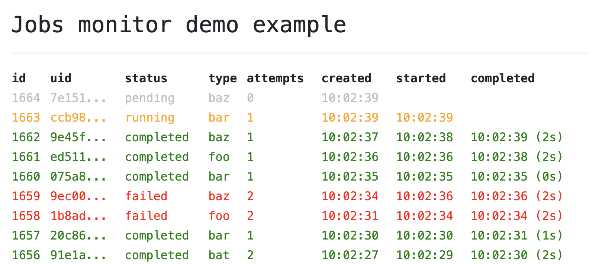

# @marianmeres/steve

[](https://www.npmjs.com/package/@marianmeres/steve)
[](https://jsr.io/@marianmeres/steve)
[](https://opensource.org/licenses/MIT)

PostgreSQL based jobs processing manager.

Supports concurrent multiple "workers" (job processors), job scheduling,
configurable retry logic, configurable max allowed duration per attempt, configurable backoff
strategies, database resilience with automatic retries, health monitoring, detailed logging and more...

Uses [node-postgres](https://node-postgres.com/) internally.

## Installation

```shell
deno add jsr:@marianmeres/steve
```

```shell
npm i @marianmeres/steve
```

## Basic Usage

### Job handlers

Job handling function(s) can be specified via constructor options either as a single
`jobHandler` function or as a `jobHandlers` functions map (keyed by job type). Both options 
`jobHandlers` and `jobHandler` can be used together, where the `jobHandlers` map will 
have priority and `jobHandler` will act as a fallback.

If none of the `jobHandlers` or `jobHandler` options is specified, the system will still be
normally functional, all incoming jobs will be handled with the internal `noop` handler.

### Example

```typescript
import { Jobs } from "@marianmeres/steve";

// the manager instance
const jobs = new Jobs({
    // pg.Pool or pg.Client
    db,
    // global job handler for all jobs
    jobHandler: (job: Job) => {
        // Do the work...
        // Must throw on error.
        // Returned data will be available as the `result` prop.
    },
    // or, jobHandlers by type map
    jobHandlers: {
        my_job_type: (job: Job) => { /*...*/ },
        // ...
    },
    // how long should the worker be idle before trying to claim a new job
    pollIntervalMs, // default 1_000
    // optional: enable database retry on transient failures (default: disabled)
    dbRetry: true, // or provide custom options
    // optional: enable database health monitoring (default: disabled)
    dbHealthCheck: true, // or provide custom options
});

// later, as new job types are needed, just re/set the handler
jobs.setHandler('my_type', myHandler);
jobs.setHandler('my_type', null); // this removes the `my_type` handler altogether

// kicks off the job processing (with, let's say, 2 concurrent processors)
jobs.start(2);

// now the system is ready to handle any incoming jobs...

// stops processing (while gracefully finishes all currently running jobs)
jobs.stop();
```

## Creating a job

```typescript
const job = await jobs.create(
    'my_job_type', // required
    { foo: 'bar' }, // optional payload
    {
        // maximum number of retry attempts before giving up
        max_attempts: 3, 
        // maximum allowed attempt duration before timing out (zero means no limit)
        max_attempt_duration_ms: 0,
        // 'exp' -> exp. backoff with 2^attempts seconds
        backoff_strategy: 'exp', // or 'none' 
        // timestamp to schedule job run/start in the future
        run_at: Date
    }, // optional options
    // optional "onDone" callback for this particular job
    function onDone(job: Job) {
        // job is either completed or failed... see `job.status`
    }
);
```

## Listening to job events

Both methods below return `unsubscribe` function.

```typescript
jobs.onDone('my_job_type', (job: Job) => {
    // job is either completed or failed... see `job.status`
    // note that status `failed` is only set once 
    // max_attempts retries were reached
});

jobs.onAttempt('my_job_type', (job: Job) => {
    // maybe running, completed, maybe failed, maybe pending (planned retry)... see `job.status`
});
```

Note that the `onAttempt` is fired twice for each "physical" attempt - once just when 
the job is claimed and is starting the execution (with status `running`) and once when 
the execution is done (with one of the `completed`, `failed` or `pending`).

## Examining the job manually

```typescript
jobs.find(
    uid: string,
    withAttempts: boolean = false
): Promise<{ job: Job; attempts: null | JobAttempt[] }>;
```

## Listing all jobs

```typescript
jobs.fetchAll(
    status: undefined | null | Job["status"] | Job["status"][] = null,
    options: Partial<{ limit: number; offset: number; }> = {}
): Promise<Job[]>
```

## Database Resilience

Steve includes built-in database retry logic and health monitoring for production environments.

### Database Retry

Automatically retry database operations on transient failures (connection timeouts, resets, etc.):

```typescript
const jobs = new Jobs({
    db,
    // Enable with defaults
    dbRetry: true,
    // Or customize
    dbRetry: {
        maxRetries: 5,
        initialDelayMs: 200,
        maxDelayMs: 10_000,
    },
});
```

### Health Monitoring

Monitor database health with periodic checks and callbacks:

```typescript
const jobs = new Jobs({
    db,
    // Enable with defaults (checks every 30s)
    dbHealthCheck: true,
    // Or customize
    dbHealthCheck: {
        intervalMs: 60_000,
        onUnhealthy: (status) => console.error('DB unhealthy!', status),
        onHealthy: (status) => console.log('DB recovered!', status),
    },
});

// Check health anytime
const health = jobs.getDbHealth();
console.log('DB healthy?', health?.healthy);

// Or manually trigger a check
const currentHealth = await jobs.checkDbHealth();
```

See [USAGE_DB_RESILIENCE.md](USAGE_DB_RESILIENCE.md) for detailed configuration options.

## API Reference

For complete API documentation, types, and interfaces, see [API.md](API.md).

## Jobs monitor example



Steve comes with toy example of jobs monitoring ([server](example/server.ts) 
and [client](example/index.html)). To run it locally follow these steps:

```shell
git clone git@github.com:marianmeres/steve.git
cd steve
cp .env.example .env
```

Now edit the `.env` and set `EXAMPLE_PG_*` postgres credentials. Then, finally, 
run the server:

```shell
deno task example
```

Once deps are installed and server is running, just visit http://localhost:8000.

