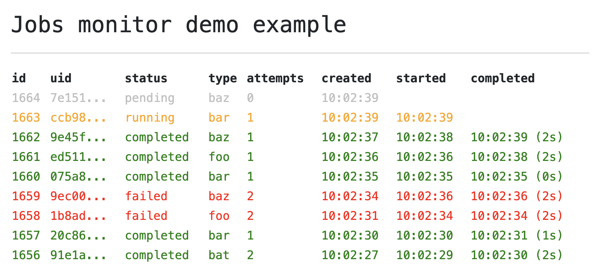

# @marianmeres/steve

[](https://www.npmjs.com/package/@marianmeres/steve)
[](https://jsr.io/@marianmeres/steve)
[](https://opensource.org/licenses/MIT)

PostgreSQL based jobs processing manager.

Supports concurrent multiple "workers" (job processors), job scheduling,
configurable retry logic (with capped exponential backoff), configurable max allowed duration
per attempt (with cooperative `AbortSignal`), database resilience with automatic retries and
real single-connection transactions, health monitoring, automatic cleanup of crashed-worker
leftovers, detailed logging and more...

Uses [node-postgres](https://node-postgres.com/) internally.

## Installation

```shell
deno add jsr:@marianmeres/steve
```

```shell
npm i @marianmeres/steve
```

## Basic Usage

### Job handlers

Job handling function(s) can be specified via constructor options either as a single
`jobHandler` function or as a `jobHandlers` functions map (keyed by job type). Both options 
`jobHandlers` and `jobHandler` can be used together, where the `jobHandlers` map will 
have priority and `jobHandler` will act as a fallback.

If none of the `jobHandlers` or `jobHandler` options is specified, the system will still be
normally functional, all incoming jobs will be handled with the internal `noop` handler.

### Example

```typescript
import { Jobs } from "@marianmeres/steve";

// the manager instance
const jobs = new Jobs({
    // pg.Pool (recommended), or pg.Client (then `start(1)` only — a single
    // connection cannot run concurrent transactions)
    db,
    // global job handler for all jobs
    jobHandler: (job: Job, signal?: AbortSignal) => {
        // Do the work...
        // Must throw on error.
        // Returned data will be available as the `result` prop.
        // The AbortSignal fires when `max_attempt_duration_ms` elapses — respect it
        // (e.g. pass to `fetch`) so you can bail out early on timeout.
    },
    // or, jobHandlers by type map
    jobHandlers: {
        my_job_type: (job: Job) => { /*...*/ },
        // ...
    },
    // how long the worker idles before polling for a new job (±25% jitter applied)
    pollTimeoutMs, // default 1_000
    // optional: enable database retry on transient failures (default: disabled)
    dbRetry: true, // or provide custom options
    // optional: enable database health monitoring (default: disabled)
    dbHealthCheck: true, // or provide custom options
    // optional: periodic reaping of crashed-worker leftovers (default: disabled)
    autoCleanup: true, // or { intervalMs, maxAllowedRunDurationMinutes }
});

// later, as new job types are needed, just re/set the handler
jobs.setHandler('my_type', myHandler);
jobs.setHandler('my_type', null); // this removes the `my_type` handler altogether

// kicks off the job processing (with, let's say, 2 concurrent processors).
// Throws on initialization failure; idempotent on repeat calls while already running.
await jobs.start(2);

// now the system is ready to handle any incoming jobs...

// stops processing (while gracefully finishes all currently running jobs, stops
// the health monitor/auto-cleanup and removes the SIGTERM listener)
await jobs.stop();
```

## Creating a job

```typescript
const job = await jobs.create(
    'my_job_type', // required
    { foo: 'bar' }, // optional payload
    {
        // maximum number of retry attempts before giving up
        max_attempts: 3, 
        // maximum allowed attempt duration before timing out (zero means no limit)
        max_attempt_duration_ms: 0,
        // 'exp' -> exp. backoff with 2^attempts seconds
        backoff_strategy: 'exp', // or 'none' 
        // timestamp to schedule job run/start in the future
        run_at: Date,
        // optional tenant to tag the job with, for audit/filtering (see Multitenancy)
        tenant_id: 'acme'
    }, // optional options
    // optional "onDone" callback for this particular job (in-process only — see
    // "Listening to job events"; an error thrown here is logged, it never re-runs the job)
    function onDone(job: Job) {
        // job is either completed, failed or expired... see `job.status`
    }
);
```

## Listening to job events

Both methods below return `unsubscribe` function.

```typescript
jobs.onDone('my_job_type', (job: Job) => {
    // Fires on terminal state: `completed`, `failed` (all retries exhausted),
    // or `expired` (worker crashed and the reaper picked it up).
});

jobs.onAttempt('my_job_type', (job: Job) => {
    // Fires on every state transition: `running`, `completed`, `failed`, or `pending` (planned retry).
});
```

Note that the `onAttempt` is fired twice for each "physical" attempt - once just when 
the job is claimed and is starting the execution (with status `running`) and once when 
the execution is done (with one of the `completed`, `failed` or `pending`).

**Events are in-process.** They are published by the `Jobs` instance that finalizes the
job (its own processors, or its own `cleanup()`), not through the database. In a topology
where one process creates jobs and another runs the workers, listeners registered in the
creating process never fire — poll `jobs.find(uid)` there instead. The same holds for the
per-job `onDoneFor` / `onAttemptFor` / `create(..., onDone)` callbacks, which additionally
stay registered until that job is finalized by this instance (or until `unsubscribeAll()`).

**Listeners are isolated from the job lifecycle.** An exception thrown (or a rejected
promise returned) by any listener is logged and dropped; it never marks the job as failed
or re-runs it.

## Automatic cleanup of stuck jobs

If a worker process crashes mid-job, the row stays in `running` until it is explicitly
reaped. Enable `autoCleanup` to have Steve do this periodically, or call
`jobs.cleanup()` manually. Reaped jobs are marked as `expired`, have `completed_at` set,
and fire `onDone` so consumers can react.

```typescript
new Jobs({
    db,
    autoCleanup: {
        intervalMs: 60_000,                   // check every minute
        maxAllowedRunDurationMinutes: 5,      // "stuck" threshold
    },
});
```

The threshold is measured on the **current attempt** (the time it was claimed), so a job
on its third retry is not reaped just because its first attempt was long ago. Pick a
threshold above your longest legitimate attempt, or bound attempts with
`max_attempt_duration_ms`. Should the reaper still fire on a handler that is in fact
running, that handler's eventual outcome is recorded in the attempt log only: the row stays
`expired`, its `result` is not stored, and `onDone` is not fired a second time.

## Graceful shutdown (SIGTERM)

With the default `gracefulSigterm: true`, `start()` installs a `SIGTERM` listener that
calls `stop()` (finishes in-flight jobs, stops the reaper and the health monitor) and
removes itself. Installing any signal listener suppresses the runtime's default
"terminate on SIGTERM", so once `stop()` has finished Steve checks whether anybody else is
still listening: if not, it re-raises `SIGTERM` and the process terminates exactly as it
would have without Steve. If you have your own `SIGTERM` handler (closing an HTTP server,
etc.), you own the exit — call `process.exit()` yourself when you are done.

Pass `gracefulSigterm: false` to opt out entirely and call `await jobs.stop()` from your
own shutdown sequence.

## Examining the job manually

```typescript
jobs.find(
    uid: string,
    withAttempts: boolean = false,
    // optional tenant guard - a mismatch is reported as not-found (job is undefined)
    options: { tenant_id?: string | null } = {}
): Promise<{ job: Job | undefined; attempts: null | JobAttempt[] }>;
```

`job` is `undefined` when not found. A malformed (non-UUID) `uid` is reported the same
way rather than as a database error, so the method is safe to feed untrusted ids.

## Listing all jobs

```typescript
jobs.fetchAll(
    status: undefined | null | Job["status"] | Job["status"][] = null,
    options: Partial<{
        limit: number;
        offset: number;
        // optionally restrict to one or more tenants
        tenant_id: string | string[] | null;
    }> = {}
): Promise<Job[]>
```

## Purging old jobs

Nothing deletes finished jobs automatically, so the `__job` table (and the attempt log,
which cascades) grows without bound. Call `purge()` periodically with a retention that
suits your audit needs. Only terminal statuses (`completed`, `failed`, `expired`) can be
purged; `pending` / `running` rows are never touched.

```typescript
// delete terminal jobs that finished more than 7 days ago (the default)
const deleted = await jobs.purge();

// keep failures around longer than successes
await jobs.purge(24 * 60, { statuses: ['completed'] });
await jobs.purge(30 * 24 * 60, { statuses: ['failed', 'expired'] });

// one tenant only
await jobs.purge(7 * 24 * 60, { tenant_id: 'acme' });
```

## Multitenancy (`tenant_id`)

Steve has an **optional**, free-form `tenant_id` column on every job, following the
ecosystem tenant convention. It is purely for **audit / scoping / filtering** — there is
**no foreign key** and no tenant registry table is required. If you never set it, nothing
changes: jobs are created with `tenant_id = null` (global / un-scoped) and every API
behaves exactly as before.

```typescript
// tag a job
await jobs.create('send-email', { to: '...' }, { tenant_id: 'acme' });

// the tag is on the returned row and survives processing
const { job } = await jobs.find(uid);
job.tenant_id; // 'acme' | null

// audit / filter by tenant
await jobs.fetchAll(null, { tenant_id: 'acme' });             // one tenant
await jobs.fetchAll('failed', { tenant_id: ['acme', 'bca'] }); // many + status
await jobs.healthPreview(60, { tenant_id: 'acme' });          // per-tenant stats
await jobs.cleanup(5, { tenant_id: 'acme' });                 // reap one tenant's stuck jobs
```

Notes / scope:

- **Workers stay tenant-blind.** A worker pool drains jobs for **all** tenants (including
  global `null` jobs) regardless of how they were tagged — per-tenant worker pools and
  cross-tenant fairness are intentionally out of scope.
- **`autoCleanup` is always tenant-blind** (it reaps every tenant). Pass `tenant_id` to a
  manual `cleanup()` call when you need scoped reaping.
- **Events are tenant-blind.** A type-keyed `jobs.onDone('email', cb)` fires for **every**
  tenant's `email` jobs — filter on `job.tenant_id` inside the callback if you need
  per-tenant reaction. (`onDoneFor` / `create(..., onDone)` are uid-keyed and inherently
  tenant-safe.)
- There is **no FK** by design. If you want referential integrity to a tenant registry,
  add the constraint yourself in an app-level migration (e.g. `ALTER TABLE __job ADD
  CONSTRAINT ... FOREIGN KEY (tenant_id) REFERENCES ... NOT VALID`).

## Database Resilience

Steve includes built-in database retry logic and health monitoring for production environments.

### Database Retry

Automatically retry database operations on transient failures (connection timeouts, resets, etc.):

```typescript
const jobs = new Jobs({
    db,
    // Enable with defaults
    dbRetry: true,
    // Or customize
    dbRetry: {
        maxRetries: 5,
        initialDelayMs: 200,
        maxDelayMs: 10_000,
    },
});
```

### Health Monitoring

Monitor database health with periodic checks and callbacks:

```typescript
const jobs = new Jobs({
    db,
    // Enable with defaults (checks every 30s)
    dbHealthCheck: true,
    // Or customize
    dbHealthCheck: {
        intervalMs: 60_000,
        onUnhealthy: (status) => console.error('DB unhealthy!', status),
        onHealthy: (status) => console.log('DB recovered!', status),
    },
});

// Check health anytime
const health = jobs.getDbHealth();
console.log('DB healthy?', health?.healthy);

// Or manually trigger a check
const currentHealth = await jobs.checkDbHealth();
```

See [USAGE_DB_RESILIENCE.md](USAGE_DB_RESILIENCE.md) for detailed configuration options.

## API Reference

For complete API documentation, types, and interfaces, see [API.md](API.md).

## Jobs monitor example



Steve comes with toy example of jobs monitoring ([server](example/server.ts) 
and [client](example/index.html)). To run it locally follow these steps:

```shell
git clone git@github.com:marianmeres/steve.git
cd steve
cp .env.example .env
```

Now edit the `.env` and set `EXAMPLE_PG_*` postgres credentials. Then, finally, 
run the server:

```shell
deno task example
```

Once deps are installed and server is running, just visit http://localhost:8000.

## Upgrading from 1.x to 2.0

Version 2.0.0 fixes several correctness and security bugs. Most users won't
need code changes, but a few behaviors differ:

- **`Jobs.start()` now throws on initialization failure** (previously it logged
  and silently returned). Wrap in try/catch if you relied on the swallowed error.
- **`Jobs.start()` is idempotent** — calling it twice no longer doubles the
  processor count. Re-start via `stop()` then `start()`.
- **`jobs.cleanup()` returns `number`** (count of reaped jobs) instead of
  `void`, and now fires `onDone` events for each expired job. If you had listeners
  that assumed only completed/failed statuses reach onDone, branch on
  `job.status === "expired"` as well.
- **`Job.status` TypeScript union now includes `"expired"`** (was runtime-only
  previously). This is a widening; `switch` statements without an `expired` arm
  still compile but you should add one.
- **`JobHandler` signature adds an optional `signal?: AbortSignal`** as the
  second argument. Existing handlers that take only `(job)` continue to work.
- **Exponential backoff is now capped at 1 hour.** If you deliberately relied
  on multi-day backoff at high attempt counts, you'll need a custom scheduling
  strategy.
- **`started_at` now records the FIRST attempt start, not the latest.** If you
  queried `started_at` expecting the current retry's start, switch to
  `updated_at` or to the latest attempt log row.

## Upgrading to 3.x (optional `tenant_id`)

3.x adds the optional [`tenant_id`](#multitenancy-tenant_id) column. It is additive and
opt-in; **single-tenant / tenant-unaware users need no code or behavior changes**.

- **`Job` now always carries a `tenant_id: string | null` field.** This is the only
  breaking change and it is **type-level only**: code that *reads* `Job` is unaffected
  (the field is simply present, `null` for un-scoped jobs); code that *constructs* `Job`
  object literals (mocks/fixtures) must add `tenant_id`.
- **The `__job` table auto-gains a nullable `tenant_id` column** on next start via
  `ALTER TABLE ... ADD COLUMN IF NOT EXISTS` (metadata-only — instant, no table rewrite;
  existing rows read back `null`). The runtime claim query and the default index layout
  are unchanged; one additional **partial** index is added (zero write cost while all
  `tenant_id` are `null`). The attempt-log table is intentionally unchanged.
- **No FK and no tenant registry are required.** `create()`, `find()`, `fetchAll()`,
  `healthPreview()` and `cleanup()` gain optional `tenant_id` arguments; omitting them
  preserves today's behavior exactly.

## Upgrading from 3.0

Behavioral fixes. Most code needs no change, but review these:

- **`find()` now returns `job: Job | undefined`.** It always could be `undefined` at
  runtime; the type said otherwise. Narrow with `if (job)` before use. A malformed
  (non-UUID) `uid` is reported as not-found instead of raising a Postgres error.
- **The reaper measures the current attempt.** `cleanup()` / `autoCleanup` compare the
  threshold against the time the running attempt was claimed (`updated_at`), not against
  `started_at` (first attempt). Previously a legitimately running retry could be expired
  merely because its first attempt was long ago.
- **Terminal states are final.** A handler whose job was meanwhile marked `expired` no
  longer overwrites it with `completed` / `pending` / `failed`; its outcome goes to the
  attempt log only, and `onDone` does not fire twice.
- **Per-job callbacks are isolated.** An exception in `create(..., onDone)`, `onDoneFor`
  or `onAttemptFor` is logged. Previously it was recorded as a handler failure and could
  re-run an already-completed job.
- **`pg.Client` is limited to one processor.** `start(n > 1)` with a `pg.Client` throws.
- **SIGTERM re-raise.** After the default handler has stopped processing, it re-raises
  `SIGTERM` when no other listener exists, so the process terminates instead of idling.
- **`unsubscribeAll()` also clears per-job callbacks.**
- **`resetHard()` always resets**, even on an already-initialized instance.
- **New: `purge()`** for deleting old terminal jobs.

## License

[MIT](LICENSE)
